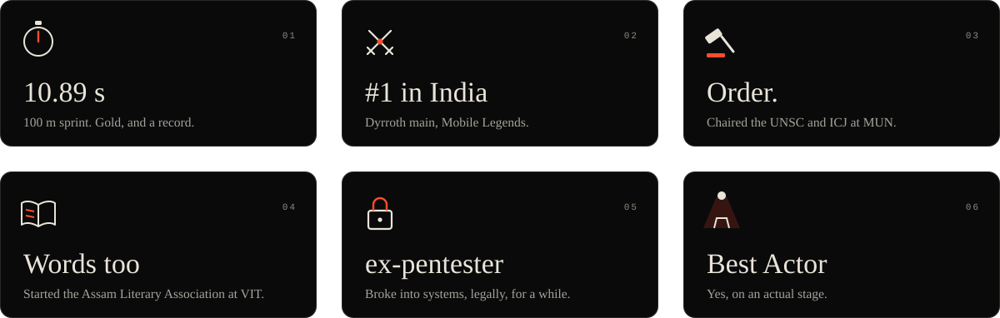

  
  
  
  
  
  

Hi, I'm Jyotishman. I grew up in Guwahati on sci-fi, AI suits and wormholes, and at seven I decided I was going to build the things I saw on screen. I'm still at it, just with better soldering. These days I'm in Chennai, running [Sentrix Robotics](https://www.sentrixrobotics.com/) and trying to give robots something they've never had: a sense of touch.

### How I got here

### Off the bench

### Right now

If you're working on robots that need to feel, [say hi](mailto:jyotishmandas.official@gmail.com).

**A few things I've built:** [Haptic Prosthetic](https://github.com/jyotishmannnnn/SIH-Prosthetic-Haptic-Feedback) · [NeuroHand](https://github.com/jyotishmannnnn/NeuroHand-EEG-Based-Prosthetic-Control-System) · [GestureLIO](https://github.com/jyotishmannnnn/GestureLIO) · [ReFold](https://github.com/jyotishmannnnn/ReFlow) · [SyncRoom](https://github.com/jyotishmannnnn/SyncRoom) · [ContactHarvester](https://github.com/jyotishmannnnn/ContactHarvester)

**What I reach for:**

  
  
  
  
  
  
  
  
  
  
  
  

<picture>
  <source media="(prefers-color-scheme: dark)" srcset="https://raw.githubusercontent.com/jyotishmannnnn/jyotishmannnnn/output/snake-dark.svg">
  
</picture>

More at <a href="https://www.jyotishmandas.in/">jyotishmandas.in</a>
